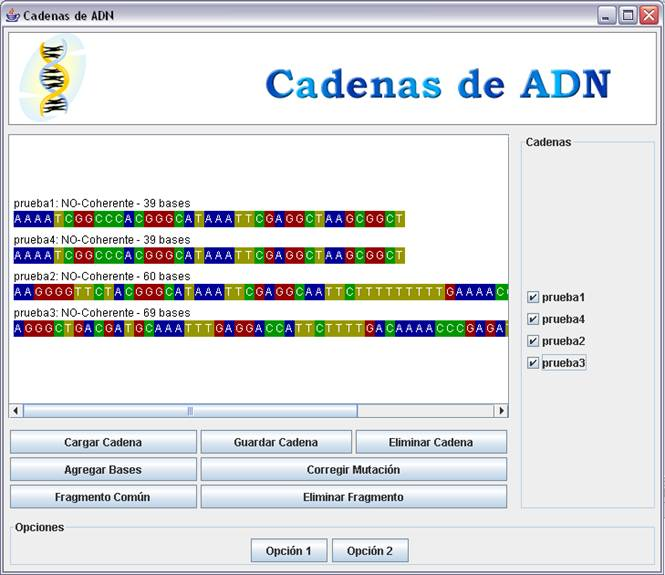
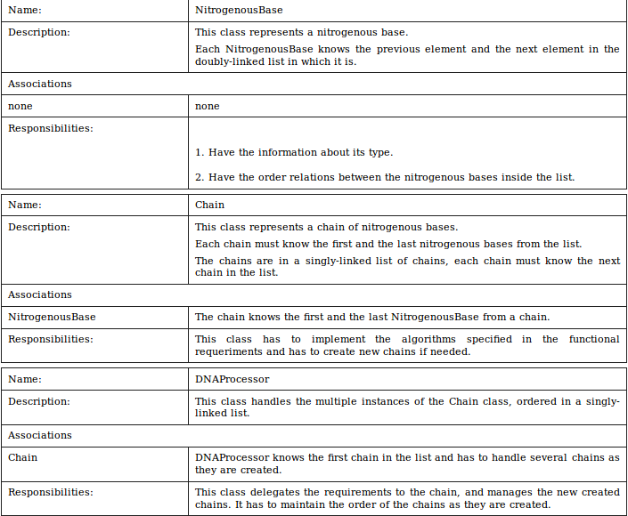

# Application Description

The application to be built allows the manipulation and visualization of DNA chains.

Initial chains must be loaded from text files, the chains built modifying the initial
chains could be saved in text files using the same format.

The operations that could be done over the chains are:

    * Load a chain
    * Save a chain
    * Delete a chain
    * Add to a chain the nitrogenous bases from another
    * Correct a mutation from a chain
    * Find the longest common fragment between two chains
    * Delete a fragment from a chain

# Graphic User Interface

    Main Window

DNA chains are very long sequences of simpler elements called nitrogenous bases.
In this context, there are 4 types of nitrogenous bases: Adenine (A), Thymine (T),
Guanine (G) and Cytosine (C). Different sections from a chain determine different
characteristics from an individual: The expression of that characteristic depends
exclusively from the types of nitrogenous bases inside the chain.

In the life beings, DNA chains are not a single string but two of them linked in a
double helix, united by nitrogenous bases. The formation of this helix is ruled in
a specific way: Adenine can only match with Thymine and Cytosine can only match with
Guanine. Given a DNA chain, if this chain can be bent by its center and form the
right matches, in this context, it will be a coherent chain .

In this application, the concepts Nitrogenous Bases and DNA Chains have to be modeled.
It will also have to work with several DNA chains.

The files in which the chain information will be saved have two lines. In the first
one there is the description of the chain, in the second one there is the nitrogenous
bases sequence, expressed in the four correspondent letters (A, T, G and C).

## Analysis

The nitrogenous bases are the simplest element in the system. In this context the
only relevant information about them will be their type (A, T, G or C).

Chains to be handled will be only a string and will be made of nitrogenous bases.
In those chains the order is important and they will be a lineal structure. This means
that there has to be two ends and it has to be possible go from one end to the other.

Finally, it is necessary to handle sets of chains. This responsibilities of handling
will be owned by a DNA Processor.

## Design

Next, the solution design based on singly-linked and doubly-linked lists.

### Solution Structure

Elements detected in the analysis, will have a representation on a three classes
model: DNAProcessor, Chain and NitrogenousBase.

NitrogenousBase class only model the type of a nitrogenous base.

Chain class represents a list of nitrogenous bases. For efficiency reasons,
they will be ordered on a doubly-linked list with a head and a tail.

DNAProcessor class will handle a set of Chains, ordered according to their length,
in a singly-linked list with just a head.

